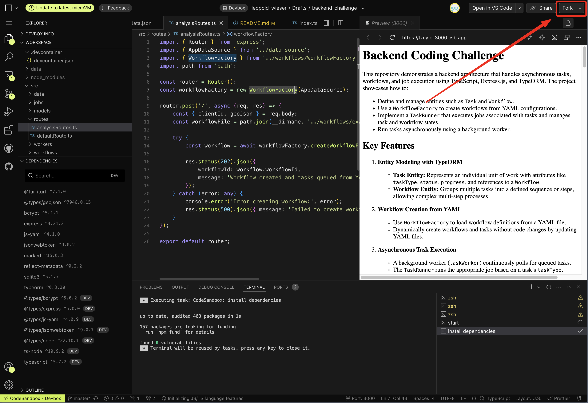

# Backend Coding Challenge

## Getting Started

1. Fork the Project:
   
2. Start Coding

This repository demonstrates a backend architecture that handles asynchronous tasks, workflows, and job execution using TypeScript, Express.js, and TypeORM. The project showcases how to:

- Define and manage entities such as `Task` and `Workflow`.
- Use a `WorkflowFactory` to create workflows from YAML configurations.
- Implement a `TaskRunner` that executes jobs associated with tasks and manages task and workflow states.
- Run tasks asynchronously using a background worker.

---

## ✅ Implementation Complete

All 6 challenge tasks have been implemented and tested:

| # | Task | Status |
|---|------|--------|
| 1 | PolygonAreaJob - Calculate polygon area | ✅ Done |
| 2 | ReportGenerationJob - Aggregate task outputs | ✅ Done |
| 3 | Task Dependencies - Support `dependsOn` in YAML | ✅ Done |
| 4 | Final Workflow Results - Save aggregated results | ✅ Done |
| 5 | GET /workflow/:id/status - Status endpoint | ✅ Done |
| 6 | GET /workflow/:id/results - Results endpoint | ✅ Done |

---

## Key Features

1. **Entity Modeling with TypeORM**
   - **Task Entity:** Represents an individual unit of work with attributes like `taskType`, `status`, `progress`, `stepId`, `dependsOn`, and references to a `Workflow`.
   - **Workflow Entity:** Groups multiple tasks into a defined sequence with `finalResult` for aggregated outputs.

2. **Workflow Creation from YAML**
   - Use `WorkflowFactory` to load workflow definitions from a YAML file.
   - Support for task dependencies via `dependsOn` field.

3. **Asynchronous Task Execution**
   - A background worker (`taskWorker`) continuously polls for `queued` tasks.
   - Tasks only execute when all dependencies are completed.

4. **Robust Status Management**
   - `TaskRunner` updates task status (queued → in_progress → completed/failed).
   - Workflow status is evaluated after each task completes.
   - Final results are aggregated when workflow completes.

5. **Available Jobs**
   - `polygonArea` - Calculates polygon area using @turf/area
   - `analysis` - Determines which country a polygon is within
   - `report` - Generates aggregated report from all task outputs
   - `notification` - Sends email notifications

---

## Project Structure

```
src
├─ data/
│   └─ world_data.json        # Country boundary data for analysis
│
├─ models/
│   ├─ Result.ts              # Result entity
│   ├─ Task.ts                # Task entity (with stepId, dependsOn)
│   └─ Workflow.ts            # Workflow entity (with finalResult)
│
├─ jobs/
│   ├─ Job.ts                 # Job interface
│   ├─ JobFactory.ts          # Maps taskType to Job class
│   ├─ DataAnalysisJob.ts     # Checks if polygon is within a country
│   ├─ EmailNotificationJob.ts # Sends notifications
│   ├─ PolygonAreaJob.ts      # ✅ NEW: Calculates polygon area
│   └─ ReportGenerationJob.ts # ✅ NEW: Generates workflow report
│
├─ workflows/
│   ├─ WorkflowFactory.ts     # Creates workflows from YAML (with dependency parsing)
│   └─ example_workflow.yml   # Workflow definition with dependencies
│
├─ workers/
│   ├─ taskRunner.ts          # Executes jobs & aggregates final results
│   └─ taskWorker.ts          # Background worker (respects dependencies)
│
├─ routes/
│   ├─ analysisRoutes.ts      # POST /analysis
│   ├─ workflowRoutes.ts      # ✅ NEW: GET /workflow/:id/status & /results
│   └─ defaultRoute.ts        # Default route
│
├─ __tests__/                 # ✅ NEW: Unit tests (41 tests)
│   ├─ PolygonAreaJob.test.ts
│   ├─ ReportGenerationJob.test.ts
│   ├─ TaskDependencies.test.ts
│   ├─ workflowRoutes.test.ts
│   └─ analysisRoutes.test.ts
│
├─ data-source.ts             # TypeORM configuration
└─ index.ts                   # Express server & worker initialization
```

---

## Installation & Running

### Prerequisites
- Node.js (LTS recommended)
- npm or yarn
- SQLite (included)

### Installation

```bash
# Clone the repository
git clone https://github.com/yourusername/backend-coding-challenge.git
cd backend-coding-challenge

# Install dependencies
npm install

# Start the server
npm start
```

The server will start at `http://localhost:3000`

### Running Tests

```bash
# Run all tests
npm test

# Run tests with coverage
npm run test:coverage

# Run tests in watch mode
npm run test:watch
```

---

## API Endpoints

### POST /analysis
Creates a new workflow with tasks from the YAML definition.

**Request:**
```bash
curl -X POST http://localhost:3000/analysis \
  -H "Content-Type: application/json" \
  -d '{
    "clientId": "client123",
    "geoJson": {
      "type": "Polygon",
      "coordinates": [[
        [-63.624885, -10.311050],
        [-63.624885, -10.367865],
        [-63.612783, -10.367865],
        [-63.612783, -10.311050],
        [-63.624885, -10.311050]
      ]]
    }
  }'
```

**Response (202 Accepted):**
```json
{
  "workflowId": "e0abf30a-ee50-4ada-ba2f-40891d22c76c",
  "message": "Workflow created and tasks queued from YAML definition."
}
```

**Validation Errors (400):**
```json
{ "error": "Invalid request", "message": "clientId is required and must be a string" }
{ "error": "Invalid request", "message": "geoJson is required and must be a valid GeoJSON object" }
{ "error": "Invalid GeoJSON", "message": "geoJson.type must be one of: Polygon, MultiPolygon, Feature, FeatureCollection" }
```

---

### GET /workflow/:id/status
Returns the current status of a workflow including task progress.

**Request:**
```bash
curl http://localhost:3000/workflow/{workflowId}/status
```

**Response (200 OK):**
```json
{
  "workflowId": "e0abf30a-ee50-4ada-ba2f-40891d22c76c",
  "status": "in_progress",
  "completedTasks": 2,
  "failedTasks": 0,
  "inProgressTasks": 1,
  "totalTasks": 4
}
```

**Response (404 Not Found):**
```json
{
  "error": "Workflow not found",
  "workflowId": "invalid-id"
}
```

---

### GET /workflow/:id/results
Returns the final results of a completed workflow.

**Request:**
```bash
curl http://localhost:3000/workflow/{workflowId}/results
```

**Response (200 OK):**
```json
{
  "workflowId": "e0abf30a-ee50-4ada-ba2f-40891d22c76c",
  "status": "completed",
  "finalResult": {
    "workflowId": "e0abf30a-ee50-4ada-ba2f-40891d22c76c",
    "clientId": "client123",
    "status": "completed",
    "completedAt": "2024-01-15T10:30:00Z",
    "results": [
      {
        "taskId": "uuid",
        "taskType": "polygonArea",
        "stepNumber": 1,
        "status": "completed",
        "output": { "area": 8363324.27, "unit": "square meters" }
      },
      {
        "taskId": "uuid",
        "taskType": "analysis",
        "stepNumber": 2,
        "status": "completed",
        "output": "Brazil"
      },
      {
        "taskId": "uuid",
        "taskType": "report",
        "stepNumber": 3,
        "status": "completed",
        "output": { "workflowId": "...", "tasks": [...], "finalReport": "..." }
      },
      {
        "taskId": "uuid",
        "taskType": "notification",
        "stepNumber": 4,
        "status": "completed",
        "output": {}
      }
    ],
    "summary": { "total": 4, "completed": 4, "failed": 0 }
  }
}
```

**Response (400 Bad Request):**
```json
{
  "error": "Workflow not yet completed",
  "workflowId": "e0abf30a-ee50-4ada-ba2f-40891d22c76c",
  "currentStatus": "in_progress"
}
```

**Response (404 Not Found):**
```json
{
  "error": "Workflow not found",
  "workflowId": "invalid-id"
}
```

---

## Workflow YAML Format

The workflow is defined in `src/workflows/example_workflow.yml`:

```yaml
name: "example_workflow"
steps:
  - id: "polygonArea"
    taskType: "polygonArea"
    stepNumber: 1
  - id: "analysis"
    taskType: "analysis"
    stepNumber: 2
  - id: "report"
    taskType: "report"
    stepNumber: 3
    dependsOn:
      - "polygonArea"
      - "analysis"
  - id: "notification"
    taskType: "notification"
    stepNumber: 4
    dependsOn:
      - "report"
```

### YAML Fields:
| Field | Required | Description |
|-------|----------|-------------|
| `id` | No | Unique step identifier for dependency reference |
| `taskType` | Yes | Type of job to execute |
| `stepNumber` | Yes | Execution order |
| `dependsOn` | No | Array of step IDs that must complete first |

---

## Task Execution Flow

```
┌─────────────────┐
│ POST /analysis  │
└────────┬────────┘
         │
         ▼
┌─────────────────┐
│ WorkflowFactory │ → Creates Workflow + 4 Tasks
└────────┬────────┘
         │
         ▼
┌─────────────────────────────────────────────────────────┐
│                    TASK WORKER                          │
│  (Polls every 5 seconds for queued tasks)               │
└─────────────────────────────────────────────────────────┘
         │
         ▼
┌─────────────────────────────────────────────────────────┐
│ Step 1: polygonArea                                     │
│ - Calculates area: 8,363,324.27 sq meters               │
└────────┬────────────────────────────────────────────────┘
         │
         ▼
┌─────────────────────────────────────────────────────────┐
│ Step 2: analysis                                        │
│ - Determines country: "Brazil"                          │
└────────┬────────────────────────────────────────────────┘
         │
         ▼
┌─────────────────────────────────────────────────────────┐
│ Step 3: report (waits for steps 1 & 2)                  │
│ - Aggregates all task outputs into report               │
└────────┬────────────────────────────────────────────────┘
         │
         ▼
┌─────────────────────────────────────────────────────────┐
│ Step 4: notification (waits for step 3)                 │
│ - Sends email notification                              │
└────────┬────────────────────────────────────────────────┘
         │
         ▼
┌─────────────────────────────────────────────────────────┐
│ WORKFLOW COMPLETE                                       │
│ - finalResult saved with all task outputs               │
└─────────────────────────────────────────────────────────┘
```

---

## Testing with Postman

A Postman collection is included: `postman_collection.json`

### Import & Use:
1. Open Postman
2. Click **Import** → Select `postman_collection.json`
3. Start the server: `npm start`
4. Run requests in the collection

### Collection Contents:
- **1. Create Workflow** - Valid/invalid request tests
- **2. Workflow Status** - Status endpoint tests
- **3. Workflow Results** - Results endpoint tests
- **4. Full Workflow Test** - End-to-end test flow

---

## Quick Test Script

```bash
# Start server
npm start &

# Wait for server to start
sleep 3

# Create workflow
WORKFLOW_ID=$(curl -s -X POST http://localhost:3000/analysis \
  -H "Content-Type: application/json" \
  -d '{"clientId":"test","geoJson":{"type":"Polygon","coordinates":[[[-63.62,-10.31],[-63.62,-10.36],[-63.61,-10.36],[-63.61,-10.31],[-63.62,-10.31]]]}}' \
  | grep -o '"workflowId":"[^"]*"' | cut -d'"' -f4)

echo "Created workflow: $WORKFLOW_ID"

# Check status
curl -s http://localhost:3000/workflow/$WORKFLOW_ID/status

# Wait for completion (~25 seconds)
sleep 25

# Get results
curl -s http://localhost:3000/workflow/$WORKFLOW_ID/results
```

---

## Implementation Details

### 1. PolygonAreaJob (`src/jobs/PolygonAreaJob.ts`)
- Uses `@turf/area` to calculate polygon area
- Validates GeoJSON structure (Polygon/MultiPolygon)
- Returns area in square meters
- Handles invalid GeoJSON gracefully

### 2. ReportGenerationJob (`src/jobs/ReportGenerationJob.ts`)
- Aggregates outputs from all preceding tasks
- Includes task status, output, and error information
- Generates summary with completion statistics

### 3. Task Dependencies (`src/models/Task.ts`, `src/workers/taskWorker.ts`)
- `stepId` field for unique task identification
- `dependsOn` field for comma-separated dependency list
- Worker checks dependency status before executing tasks
- Failed dependencies cascade to dependent tasks

### 4. Final Workflow Results (`src/models/Workflow.ts`, `src/workers/taskRunner.ts`)
- `finalResult` field on Workflow entity
- Aggregated when workflow completes (success or failure)
- Includes all task outputs and summary statistics

### 5 & 6. Workflow Endpoints (`src/routes/workflowRoutes.ts`)
- `GET /workflow/:id/status` - Returns status with task counts
- `GET /workflow/:id/results` - Returns final results when complete
- Proper error handling (404, 400)

---

## Unit Tests

41 tests covering all implemented features:

```
src/__tests__/
├─ PolygonAreaJob.test.ts      # 6 tests
├─ ReportGenerationJob.test.ts # 4 tests
├─ TaskDependencies.test.ts    # 15 tests
├─ workflowRoutes.test.ts      # 8 tests
└─ analysisRoutes.test.ts      # 8 tests
```

Run tests:
```bash
npm test
```

---

## Original Challenge Requirements

<details>
<summary>Click to expand original challenge tasks</summary>

### **1. Add a New Job to Calculate Polygon Area**
**Objective:** Create a new job class to calculate the area of a polygon from the GeoJSON provided in the task.

### **2. Add a Job to Generate a Report**
**Objective:** Create a new job class to generate a report by aggregating the outputs of multiple tasks in the workflow.

### **3. Support Interdependent Tasks in Workflows**
**Objective:** Modify the system to support workflows with tasks that depend on the outputs of earlier tasks.

### **4. Ensure Final Workflow Results Are Properly Saved**
**Objective:** Save the aggregated results of all tasks in the workflow as the `finalResult` field of the `Workflow` entity.

### **5. Create an Endpoint for Getting Workflow Status**
**Objective:** Implement an API endpoint to retrieve the current status of a workflow.

### **6. Create an Endpoint for Retrieving Workflow Results**
**Objective:** Implement an API endpoint to retrieve the final results of a completed workflow.

</details>

---

## License

This project is for interview/assessment purposes.
